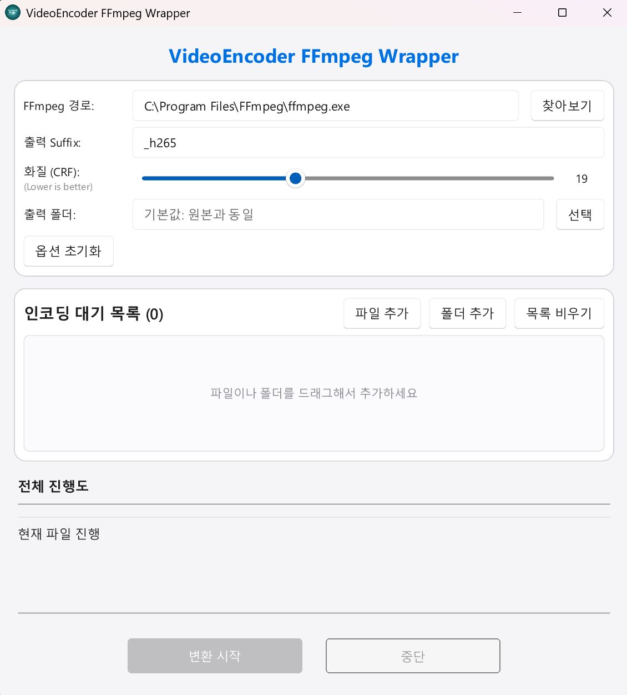

# VideoEncoder FFmpeg Wrapper

A sleek, high-performance video encoding GUI built with **Rust** and **Slint**. This tool provides a modern interface for batch converting videos using **FFmpeg** with a focus on HEVC (H.265) encoding.

 

## Key Features

-   **Modern Apple-style Light Theme**: A clean and premium interface designed for clarity and ease of use.
-   **Native Windows Drag & Drop**: Seamlessly add files and folders by dragging them into the app window (implemented via low-level `WndProc` subclassing for maximum compatibility).
-   **HEVC (H.265) Optimization**: Default configurations tailored for high-quality, low-size H.265 encoding.
-   **Detailed Progress Tracking**: Real-time parsing of FFmpeg logs to show per-file percentage, encoding speed (x speed), and live bitrate.
-   **Batch Processing**: Queue multiple files and folders for sequential encoding.
-   **Customizable Options**: Easy adjustment of CRF (Quality), output suffix, and target directory.

## Prerequisite

-   **[FFmpeg](https://ffmpeg.org/)**: You need `ffmpeg.exe` installed on your system. 
    -   The app will automatically look for `ffmpeg.exe` in its own directory.
    -   If not found, it will search your system `PATH`.
    -   You can also manually select the path within the app.

## Getting Started
### 📥 Download
You can download the latest version from the [Releases Page](https://github.com/kirinonakar/VideoEncoder/releases).

### Manual build

1.  Clone the repository:
    ```bash
    git clone https://github.com/kirinonakar/VideoEncoder.git
    cd VideoEncoder
    ```
2.  Ensure you have [Rust](https://www.rust-lang.org/tools/install) installed.
3.  Build and run the project:
    ```bash
    cargo run --release
    ```

## Technical Implementation Highlights

-   **Window Subclassing**: Uses `windows-sys` and `SetWindowLongPtrW` to hook into the Windows message loop (`WM_DROPFILES`), bypassing Slint's default D&D constraints to support administrator environments.
-   **Asynchronous Processing**: Leverages `tokio` for non-blocking FFmpeg execution and log parsing.
-   **Declarative UI**: Built using the [Slint](https://slint.dev/) UI framework for a responsive and lightweight experience.

## License

This project is licensed under the MIT License - see the [LICENSE](LICENSE) file for details.

