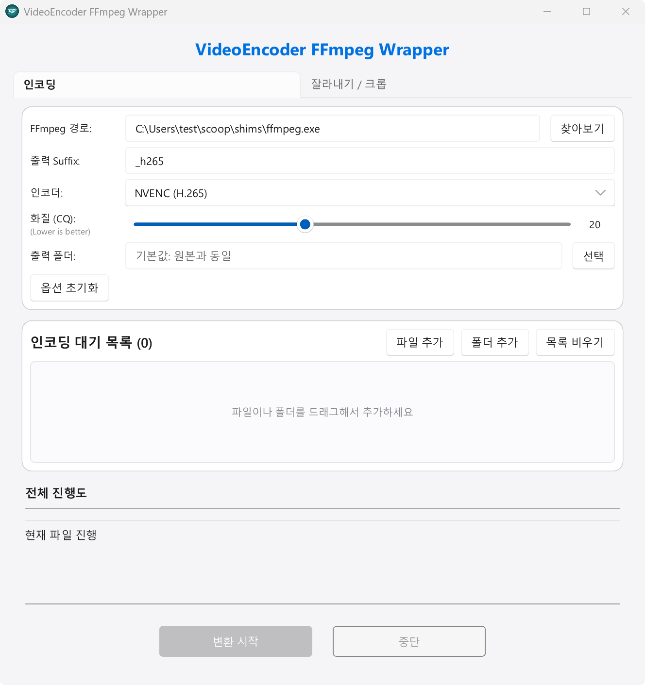

# VideoEncoder FFmpeg Wrapper

A sleek, high-performance video encoding GUI built with **Rust** and **Slint**. This tool provides a modern interface for batch converting videos using **FFmpeg** with a focus on HEVC (H.265) encoding.

 

## Key Features

-   **Light / Dark Theme**: Switch themes with the toggle at the right of the title
-   **Native Windows Drag & Drop**: Seamlessly add files and folders by dragging them into the app window (implemented via low-level `WndProc` subclassing for maximum compatibility).
-   **HEVC (H.265) Optimization**: Default configurations tailored for high-quality, low-size H.265 encoding.
-   **Detailed Progress Tracking**: Real-time parsing of FFmpeg logs to show per-file percentage, encoding speed (x speed), and live bitrate.
-   **Batch Processing**: Queue multiple files and folders for sequential encoding.
-   **Video Editor (Trim / Cut / Crop)**: Built-in preview player with frame scrubbing, lossless cutting (`-c copy`), and an interactive crop overlay with HEVC re-encoding.
-   **Selectable Encoder (NVENC / x265)**: Hardware-accelerated NVIDIA NVENC encoding (default) or software x265 encoding, with the quality slider switching between CQ and CRF automatically.
-   **Customizable Options**: Easy adjustment of encoder, quality (CRF/CQ), output suffix, and target directory.

## Prerequisite

-   **[FFmpeg](https://ffmpeg.org/)**: You need `ffmpeg.exe` installed on your system. 
    -   The app will automatically look for `ffmpeg.exe` in its own directory.
    -   If not found, it will search your system `PATH`.
    -   You can also manually select the path within the app.
-   **[FFplay](https://ffmpeg.org/)**: Required for **sound** in the video editor preview player.
    -   Place `ffplay.exe` in the **same folder as `ffmpeg.exe`** (e.g., the app's own directory).
    -   If not found there, the app falls back to searching your system `PATH`.
    -   If `ffplay.exe` cannot be found at all, the preview plays **without sound**.
-   **[NVIDIA GPU](https://www.nvidia.com/) (optional)**: Required only for **NVENC (H.265)** hardware encoding. Select **x265 (CPU)** on systems without a supported NVIDIA GPU.

## Getting Started
### 📥 Download
You can download the latest version from the [Releases Page](https://github.com/kirinonakar/VideoEncoder/releases).

### Manual build

1.  Clone the repository:
    ```bash
    git clone https://github.com/kirinonakar/VideoEncoder.git
    cd VideoEncoder
    ```
2.  Ensure you have [Rust](https://www.rust-lang.org/tools/install) installed.
3.  Build and run the project:
    ```bash
    cargo run --release
    ```

## Encoder Options

-   **NVENC (H.265)** (default): Hardware-accelerated HEVC encoding on NVIDIA GPUs. Uses `-c:v hevc_nvenc -preset p7 -rc vbr -cq <quality> -b:v 0` (constant-quality VBR). Default quality: **CQ 20**.
-   **x265 (CPU)**: Software HEVC encoding that runs on any system. Uses `-c:v libx265 -crf <quality> -preset medium`. Default quality: **CRF 19**.
-   The quality slider automatically switches between **CRF** (x265) and **CQ** (NVENC) to match the selected encoder, and each encoder keeps its own quality value.
-   The selected encoder and quality are used for both batch conversion and the **crop re-encode** in the Video Editor tab.
-   **Reset Options** restores the defaults: encoder = NVENC, CQ = 20, CRF = 19, output suffix = `_h265`.

## Video Editor (Trim / Cut / Crop)

The app includes a lightweight video editor for quick trimming and cropping right in the main window.

-   **Preview Player**: Click or drag the upper playback timeline to seek through frames (frame extraction via FFmpeg) and preview the crop area in real time.
-   **Trim / Cut**: Set the start/end points with one two-handle range slider, aligned with the playback timeline, or the **Start / End point** buttons (minimum 0.05s). Green and red markers bound the sky-blue selection. Each handle also supports arrow keys and Home/End. With playback limiting off, adjusting the range preserves the playback position and play/pause state. Cutting runs FFmpeg with `-ss`/`-t` and stream copy (`-c copy`), so it is **lossless and instant** — no re-encoding. Output: `{name}_cut.{ext}`.
-   **Crop**: Drag or resize the crop overlay directly on the preview. The selected region is applied via the FFmpeg `crop` filter and **re-encoded to HEVC (H.265)** using the configured encoder and quality (x265 CRF / NVENC CQ); the audio track is copied untouched. Output: `{name}_crop.mp4`.
-   **Playback Limit / Rewind**: Toggle **Limit playback** to constrain seeking and playback to the selected start/end range; video and audio stop at the end. The SVG rewind button moves to the beginning of the video, or the selection start while limited, preserving play/pause state.
-   **Smart Fallback**: If the crop region covers the whole frame, the app automatically runs a lossless cut instead of re-encoding.
-   **Live Feedback**: The crop coordinates (x, y, width, height) and output resolution are shown in real time, with a progress bar and status messages for both cut and crop jobs.

## Technical Implementation Highlights

-   **Window Subclassing**: Uses `windows-sys` and `SetWindowLongPtrW` to hook into the Windows message loop (`WM_DROPFILES`), bypassing Slint's default D&D constraints to support administrator environments.
-   **Asynchronous Processing**: Leverages `tokio` for non-blocking FFmpeg execution and log parsing.
-   **Declarative UI**: Built using the [Slint](https://slint.dev/) UI framework for a responsive and lightweight experience.

## License

This project is licensed under the MIT License - see the [LICENSE](LICENSE) file for details.
